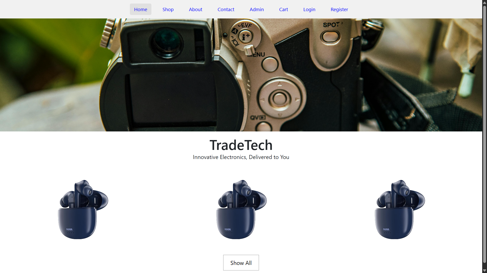
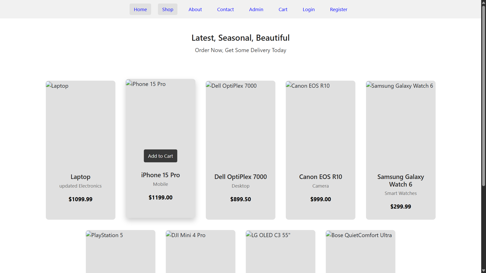
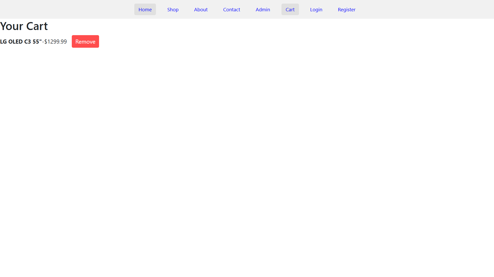
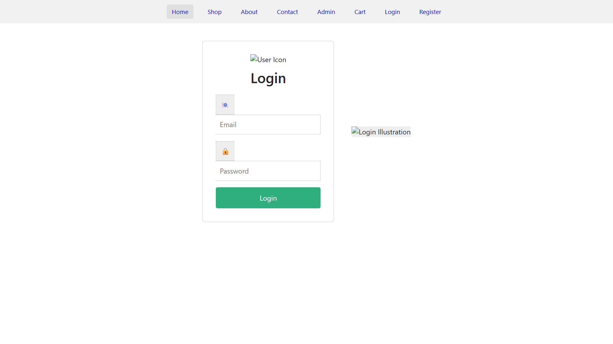
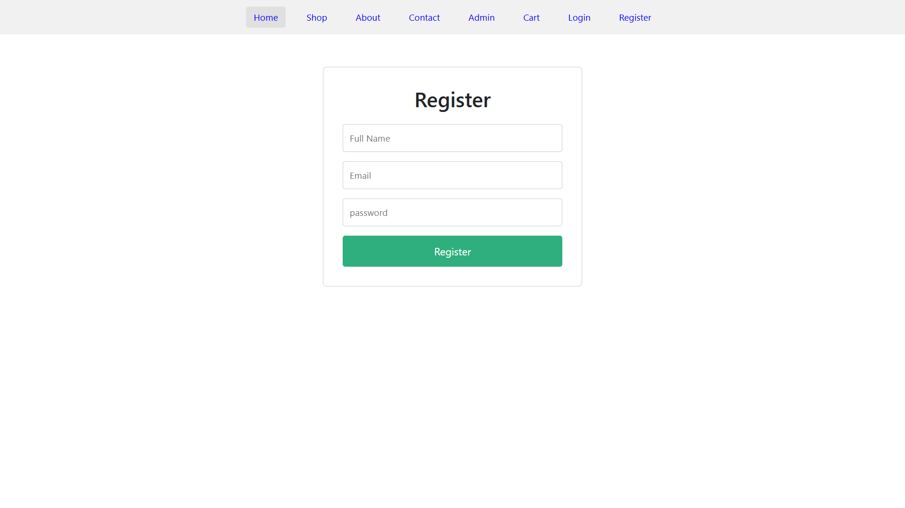
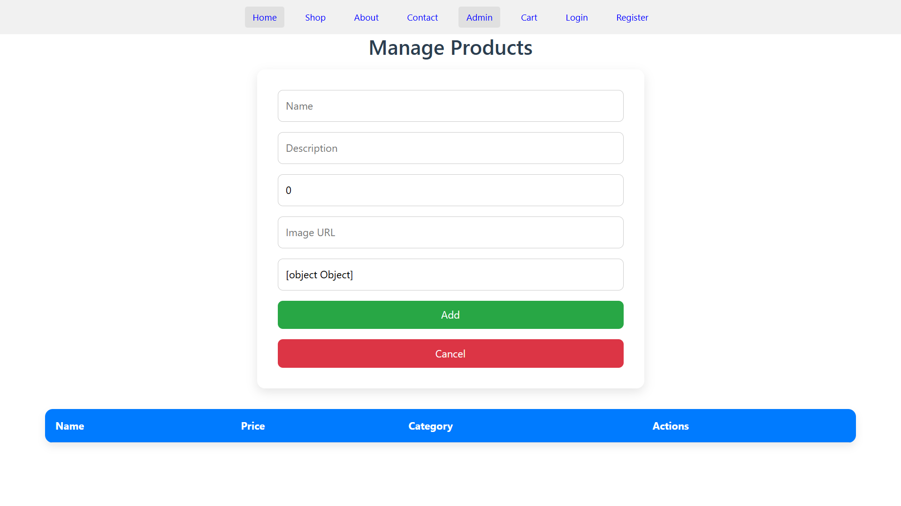
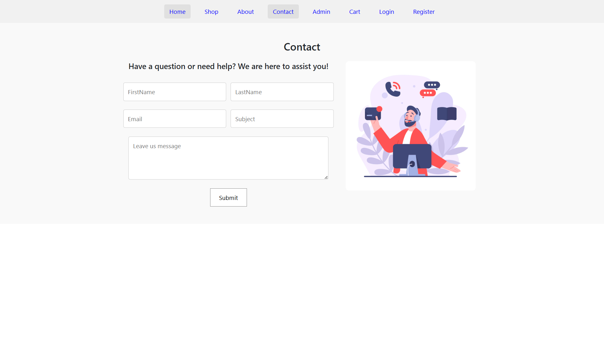
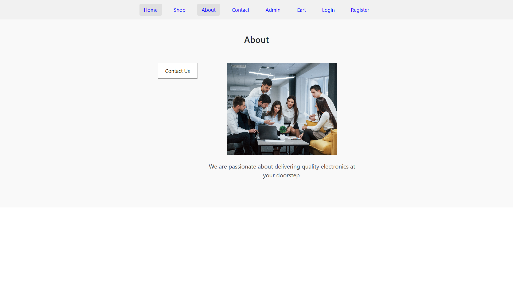

# TradeTech Shopping

A comprehensive electronic shopping website built with Angular frontend and Spring Boot backend. TradeTech Shopping provides a seamless online shopping experience for electronic products with modern web technologies.

## 🛠️ Technology Stack

### Frontend
- **Angular** - Progressive web app framework
- **TypeScript** - Strongly typed JavaScript superset
- **HTML5 & CSS3** - Modern web standards
- **Bootstrap/Angular Material** - Responsive UI components

### Backend
- **Spring Boot 3.x** - Java-based REST API framework
- **Spring Data JPA** - Object-relational mapping
- **Maven** - Project management and build tool

### Database
- **MySQL** - Relational database management system


## 🌟 Features

### Customer Features
- 🏠 **Home Page** - Featured products and navigation
- 🛒 **Shop** - Browse electronic products catalog
- 🛍️ **Shopping Cart** - Add, update, and remove items
- 👤 **User Registration** - Create new customer accounts
- 🔐 **User Login** - Secure Login system
- 📞 **Contact** - Customer support and inquiries
- ℹ️ **About** - Company information and mission

### Admin Features
- 🎛️ **Admin Dashboard** - Administrative control panel
- 📦 **Product Management** - CRUD operations on products
- 👥 **User Management** - Customer account administration
- 📊 **Order Management** - Track and process orders


## 🚀 Getting Started

### Prerequisites
- **Java 17+** - Required for Spring Boot 3.x
- **Node.js 16+** - Required for Angular
- **MySQL 8.0+** - Database server
- **Maven 3.6+** - Build automation tool
- **Angular CLI** - Command line interface

### 🔧 Backend Setup

1. **Clone the repository**
   ```bash
   git clone https://github.com/prathameshkaratkar/TradeTech-Shopping.git
   cd TradeTech-Shopping
   ```

2. **Configure MySQL Database**
   ```sql
   CREATE DATABASE tradetech_shopping;
   CREATE USER 'tradetech_user'@'localhost' IDENTIFIED BY 'your_password';
   GRANT ALL PRIVILEGES ON tradetech_shopping.* TO 'tradetech_user'@'localhost';
   FLUSH PRIVILEGES;
   ```

3. **Update application.properties**
   ```properties
   # Database Configuration
   spring.datasource.url=jdbc:mysql://localhost:3306/tradetech_shopping
   spring.datasource.username=tradetech_user
   spring.datasource.password=your_password
   spring.datasource.driver-class-name=com.mysql.cj.jdbc.Driver

   # JPA Configuration
   spring.jpa.hibernate.ddl-auto=update
   spring.jpa.show-sql=true
   spring.jpa.properties.hibernate.dialect=org.hibernate.dialect.MySQL8Dialect

   # Server Configuration
   server.port=8080
   server.servlet.context-path=/api
   ```

4. **Build and run the backend**
   ```bash
   # Navigate to backend directory
   cd backend
   
   # Install dependencies and build
   mvn clean install
   
   # Run the application
   mvn spring-boot:run
   ```

Backend will be available at `http://localhost:8080`

### 🖥️ Frontend Setup

1. **Navigate to frontend directory**
   ```bash
   cd frontend
   ```

2. **Install dependencies**
   ```bash
   npm install
   ```

3. **Update environment configuration**
   ```typescript
   // src/environments/environment.ts
   export const environment = {
     production: false,
     apiUrl: 'http://localhost:8080/api'
   };
   ```

4. **Run the development server**
   ```bash
   ng serve
   ```

Frontend will be available at `http://localhost:4200`

## 📁 Project Structure

```
TradeTech-Shopping/
├── backend/
│   ├── src/
│   │   ├── main/
│   │   │   ├── java/
│   │   │   │   └── com/tradetech/shopping/
│   │   │   │       ├── controller/
│   │   │   │       ├── entity/
│   │   │   │       ├── repository/
│   │   │   │       ├── service/
│   │   │   │       ├── config/
│   │   │   │       └── TradeTechShoppingApplication.java
│   │   │   └── resources/
│   │   │       ├── application.properties
│   │   │       └── static/
│   │   └── test/
│   └── pom.xml
├── frontend/
│   ├── src/
│   │   ├── app/
│   │   │   ├── components/
│   │   │   │   ├── home/
│   │   │   │   ├── shop/
│   │   │   │   ├── cart/
│   │   │   │   ├── login/
│   │   │   │   ├── register/
│   │   │   │   ├── admin/
│   │   │   │   ├── contact/
│   │   │   │   └── about/
│   │   │   ├── services/
│   │   │   ├── models/
│   │   │   ├── guards/
│   │   │   └── app.module.ts
│   │   ├── assets/
│   │   └── environments/
│   ├── package.json
│   └── angular.json
├── screenshots/
└── README.md
```

## 📊 Database Schema

### Core Tables
- **users** - Customer and admin user accounts
- **products** - Electronic product catalog
- **categories** - Product categorization
- **cart_items** - Shopping cart line items
- **orders** - Customer order information
- **order_items** - Order details and quantities


## 🖼️ Application Screenshots

View the application interface in the `screenshots/` directory:

- **Home Page**

- **Shop Page**

- **Cart Page**

- **Login Page**

- **Register Page** 

- **Admin Dashboard**

- **Contact Page** 

- **About Page**


## 🌐 API Endpoints


### Products
```
GET    /api/products          - Get all products
GET    /api/products/{id}     - Get product by ID
POST   /api/products          - Create product (Admin only)
PUT    /api/products/{id}     - Update product (Admin only)
DELETE /api/products/{id}     - Delete product (Admin only)
GET    /api/products/category/{categoryId} - Get products by category
```

### Cart Management
```
GET    /api/cart             - Get user's cart
POST   /api/cart/add         - Add item to cart
PUT    /api/cart/update/{id} - Update cart item quantity
DELETE /api/cart/remove/{id} - Remove item from cart
POST   /api/cart/clear       - Clear entire cart
```

### Order Management
```
GET    /api/orders           - Get user's orders
POST   /api/orders           - Create new order
GET    /api/orders/{id}      - Get order details
PUT    /api/orders/{id}      - Update order status (Admin only)
```

### Categories
```
GET    /api/categories       - Get all categories
POST   /api/categories       - Create category (Admin only)
PUT    /api/categories/{id}  - Update category (Admin only)
DELETE /api/categories/{id}  - Delete category (Admin only)
```

## 🚀 Deployment

### Backend Deployment
1. **Build the JAR file**
   ```bash
   mvn clean package -DskipTests
   ```

2. **Deploy to server**
   ```bash
   java -jar target/tradetech-shopping-backend.jar
   ```

### Frontend Deployment
1. **Build for production**
   ```bash
   ng build --configuration production
   ```

2. **Deploy dist folder** to your web server (Apache, Nginx, etc.)

3. **Configure routing** for Single Page Application

## 📝 Development Guidelines

### Code Style
- Follow Angular style guide for frontend
- Use Spring Boot best practices for backend
- Implement proper error handling
- Write unit tests for critical functions

### Git Workflow
1. Create feature branch: `git checkout -b feature/new-feature`
2. Commit changes: `git commit -m "Add new feature"`
3. Push branch: `git push origin feature/new-feature`
4. Create pull request for review

## 🧪 Testing

### Frontend Testing
```bash
# Unit tests
ng test

# End-to-end tests
ng e2e
```

### Backend Testing
```bash
# Run all tests
mvn test

# Run specific test class
mvn test -Dtest=ProductServiceTest
```

## 🔧 Troubleshooting

### Common Issues
1. **Database Connection**: Verify MySQL service is running
2. **Port Conflicts**: Check if ports 8080 and 4200 are available
3. **CORS Issues**: Ensure proper CORS configuration in Spring Boot
4. **Session Management**: Clear browser cookies for fresh session

## 📞 Support

For questions or issues:
- Create an issue on GitHub
- Contact: prathameshkaratkar2224@gmail.com
- Documentation: Check inline code comments

## 📈 Future Enhancements

- 💳 Payment gateway integration
- 📧 Email notifications
- 🔍 Advanced search with Elasticsearch
- ⭐ Product reviews and ratings
- 💝 Wishlist functionality
- 📱 Mobile app development
- 🌍 Multi-language support
- 📊 Advanced analytics dashboard

## 👨‍💻 Developer

**Prathamesh Karatkar**
- GitHub: [@prathameshkaratkar](https://github.com/prathameshkaratkar)
- LinkedIn: [https://www.linkedin.com/in/prathamesh-karatkar-307406265/]

## 📄 License

This project is licensed under the MIT License - see the [LICENSE](LICENSE) file for details.

---

**TradeTech Shopping** - Empowering your electronic shopping experience with modern technology!